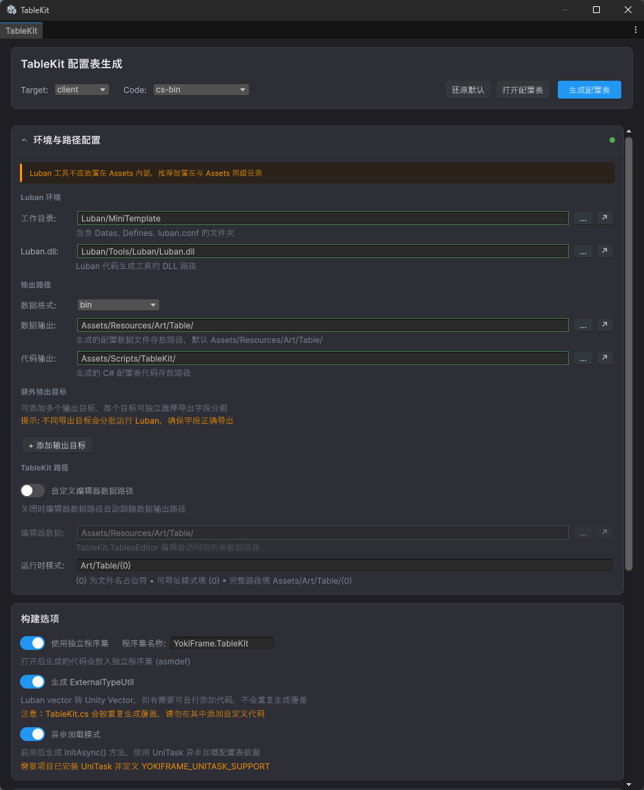

# LubanKit

[English README](README_EN.md)

**Unity Luban GUI / 配置表可视化编辑器 / 代码生成工作流工具**。

LubanKit 是一个面向 **Unity + Luban** 的图形化编辑器插件，用来替代手写命令行参数的配置流程。它适合希望在 Unity 中完成 **Luban 配置、配置表生成、运行时代码生成、数据预览、热重载** 的项目团队。

> 纯编辑器工具，生成的运行时代码**零额外运行时依赖**；适用于任何 Unity 项目，也适合作为 **Luban GUI**、**Unity 配置表工具**、**Luban table editor**、**Luban code generation workflow** 的落地方案。

---

## 功能特性

- **可视化配置** — 告别命令行，所有 Luban 参数在编辑器窗口中配置
- **一键生成** — 自动调用 Luban 生成数据文件 + 运行时代码
- **智能代码生成** — 生成 `TableKit.cs` 入口类，路径与加载逻辑内嵌，开箱即用
- **多目标输出** — 同时导出 client/server 等多平台，支持不同数据格式
- **异步加载** — 可选 UniTask 异步初始化，预缓存所有表文件后同步构造
- **自定义加载器** — 支持 Binary/JSON 同步与异步自定义加载，兼容 YooAsset、Addressables 等
- **数据预览** — 验证 Luban 配置并在编辑器中预览 JSON 数据树
- **编辑器模式** — 无需运行游戏即可在编辑器脚本中访问配置表
- **程序集隔离** — 可选生成 `.asmdef`，配置表代码独立编译
- **热重载** — 运行时重新加载配置表，支持热更新场景
- **配置持久化** — 所有设置自动保存到 `EditorPrefs`，重启编辑器不丢失

### 适用场景

- 想找一个 **Luban 的 GUI 界面**，而不是长期维护命令行脚本
- 想在 **Unity 编辑器里管理 Luban 配置表生成流程**
- 想把 **数据生成、代码生成、加载入口生成** 放到同一个工具窗口中
- 想给项目接入 **Luban + Unity** 的配置表工作流，但希望降低接入门槛
- 想要支持 **Resources / YooAsset / Addressables / 自定义加载器** 的配置表访问方案

---

## 截图预览



---

## 安装

### 前置依赖

| 依赖 | 说明 |
|------|------|
| [Luban](https://github.com/focus-creative-games/luban) | 配置表生成工具（需下载 `Luban.dll`） |
| .NET 8+ SDK | 运行 Luban 所需 |
| [Luban.Runtime](https://github.com/focus-creative-games/luban_unity) | Unity 运行时库（UPM 包，含 `ByteBuf`、`SimpleJSON` 等） |
| [UniTask](https://github.com/Cysharp/UniTask)（可选） | 异步加载模式所需 |

### 方式一：UPM Git URL（推荐）

1. 打开 Unity → `Window` → `Package Manager`
2. 点击左上角 `+` → `Add package from git URL...`
3. 输入：
   ```
   https://github.com/HinataYoki/LubanKit.git
   ```

### 方式二：手动导入

1. 下载本仓库
2. 将 `Editor/` 文件夹放入 Unity 项目的 `Assets/` 或 `Packages/` 下任意位置
3. 确保 `Luban.Runtime` 包已安装

### 条件编译

LubanKit 通过 `YOKIFRAME_LUBAN_SUPPORT` 宏控制编译。安装 `Luban.Runtime` 包后，需在 asmdef 的 `versionDefines` 或 `Project Settings > Player > Scripting Define Symbols` 中添加此宏。

> 如果在 YokiFrame 框架中使用，该宏会自动定义，无需手动配置。

---

## 快速开始

### 1. 准备 Luban 环境

确保项目中已经放好 Luban 工具目录。LubanKit 默认约定的目录结构如下：

```
Luban/
├── MiniTemplate/                 # 默认示例工作目录
│   ├── luban.conf                # Luban 配置文件
│   ├── Datas/                    # Excel / JSON 配置数据
│   │   ├── tb_item.xlsx
│   │   └── tb_config.xlsx
│   └── Defines/                  # 表结构定义
│       └── __tables__.xlsx
├── Tools/
│   └── Luban/
│       └── Luban.dll             # Luban 工具 DLL
└── ...                           # 其他工作目录或工具文件（可选）
```

其中：

- `Luban/MiniTemplate` 是一个具体的 Luban 工作目录
- `Luban/Tools/Luban/Luban.dll` 是 Luban 工具 DLL 的默认位置
- 如果你有多个工作目录，也可以把工作目录切换为其他包含 `luban.conf` 的目录

### 2. 打开工具窗口

菜单栏 → `Tools` → `TableKit` → `配置表工具`（快捷键 `Ctrl+L`）

### 3. 配置路径

首次使用时，推荐先按下面这组默认路径填写：

| 配置项 | 说明 | 示例 |
|--------|------|------|
| Luban 工作目录 | 包含 `luban.conf` 的目录 | `Luban/MiniTemplate` |
| Luban.dll 路径 | `Luban.dll` 文件路径 | `Luban/Tools/Luban/Luban.dll` |
| 数据输出目录 | Luban 生成的 `.bytes`/`.json` 存放位置 | `Assets/Resources/Art/Table/` |
| 代码输出目录 | 生成的 C# 代码存放位置 | `Assets/Scripts/TableKit/` |

> 路径支持相对路径（相对于 Unity 项目根目录）和绝对路径。

> 注意：`Luban 工作目录` 应该指向某个具体工作目录，例如 `Luban/MiniTemplate`，而不是只填 `Luban/` 根目录；`Luban.dll` 则通常位于 `Luban/Tools/Luban/Luban.dll`。

### 4. 选择构建参数

在顶部命令中心选择：

- **Target**: `client`（客户端字段）/ `server`（服务端字段）/ `all`（全部字段）
- **Code**: `cs-bin`（二进制，推荐）/ `cs-simple-json` / `cs-newtonsoft-json`

### 5. 点击「生成配置表」

工具将自动：
1. 调用 Luban 生成数据文件和 Luban 代码
2. 生成 `TableKit.cs` 运行时入口类
3. 在控制台显示执行结果

### 6. 在代码中使用

```csharp
// 同步访问（首次访问自动初始化）
var item = TableKit.Tables.TbItem.Get(1001);
Debug.Log(item.Name);
```

---

## 配置项详解

### Luban 环境

| 配置 | 说明 |
|------|------|
| **Luban 工作目录** | 具体某个 Luban 工作目录，包含 `luban.conf`、`Datas/`、`Defines/` |
| **Luban.dll 路径** | 通常位于 Luban 根目录下的 `Tools/Luban/Luban.dll` |

### 输出路径

| 配置 | 说明 |
|------|------|
| **数据输出目录** | Luban 生成的数据文件（`.bytes`/`.json`/`.lua`）存放位置 |
| **代码输出目录** | Luban 生成的 C# 类和 `TableKit.cs` 存放位置 |
| **编辑器数据路径** | 编辑器模式下加载数据的路径，默认跟随数据输出目录，可自定义 |
| **运行时路径模式** | 运行时加载资源的路径格式，如 `{0}`、`Tables/{0}`、`Art/Table/{0}` |

### 构建选项

| 选项 | 说明 |
|------|------|
| **Target** (`-t`) | 导出的字段范围：`client` / `server` / `all` |
| **Code Target** (`-c`) | 代码生成格式：`cs-bin`（推荐）/ `cs-simple-json` / `cs-newtonsoft-json` |
| **Data Target** (`-d`) | 数据序列化格式：`bin`（推荐）/ `json` / `lua`。选择 Code 时自动同步 |

### 可选功能

| 选项 | 说明 |
|------|------|
| **使用程序集定义** | 生成 `.asmdef` 文件，将配置表代码隔离编译，减少全项目重编译 |
| **生成 ExternalTypeUtil** | 生成 Luban 向量类型 ↔ Unity Vector 的转换工具类（仅首次生成，不覆盖已有文件） |
| **异步加载模式** | 生成 `InitAsync()` 方法，使用 UniTask 异步预缓存所有表数据（需安装 UniTask） |

---

## 运行时使用

### 同步访问（默认）

```csharp
// 首次访问 Tables 属性会自动调用 Init()
var tables = TableKit.Tables;

// 查询配置
var item = tables.TbItem.Get(1001);
var config = tables.TbGlobalConfig;
```

### 自定义加载器

默认使用 `Resources.Load` 加载数据。如需自定义加载逻辑：

```csharp
// Binary 加载器（cs-bin 模式）
TableKit.SetBinaryLoader(fileName =>
{
    // 返回 byte[] 数据
    var path = $"Tables/{fileName}";
    return YourLoadMethod(path);
});

// JSON 加载器（cs-simple-json / cs-newtonsoft-json 模式）
TableKit.SetJsonLoader(fileName =>
{
    // 返回 JSON 字符串
    return YourJsonLoadMethod(fileName);
});

// 设置加载器后手动初始化
TableKit.Init();
```

### YooAsset 加载器示例

```csharp
// 设置运行时路径模式（需与 YooAsset 寻址规则一致）
TableKit.RuntimePathPattern = "Art/Table/{0}";

TableKit.SetBinaryLoader(fileName =>
{
    var path = string.Format(TableKit.RuntimePathPattern, fileName);
    var package = YooAssets.GetPackage("DefaultPackage");
    var handle = package.LoadRawFileSync(path);
    var data = handle.GetRawFileData();
    handle.Release();
    return data;
});
TableKit.Init();
```

### 异步初始化（UniTask）

需在编辑器中开启「异步加载模式」并安装 UniTask。

```csharp
// 异步初始化 — 预缓存所有表文件后同步构造 Tables
await TableKit.InitAsync(destroyCancellationToken);

// 之后同步访问
var item = TableKit.Tables.TbItem.Get(1001);
```

#### 自定义异步加载器

```csharp
// 在 InitAsync 之前设置
TableKit.SetAsyncBinaryLoader(async (fileName, ct) =>
{
    var path = $"Art/Table/{fileName}";
    var package = YooAssets.GetPackage("DefaultPackage");
    var handle = package.LoadRawFileAsync(path);
    await handle.ToUniTask(cancellationToken: ct);
    var data = handle.GetRawFileData();
    handle.Release();
    return data;
});

await TableKit.InitAsync(destroyCancellationToken);
```

#### 覆盖表文件名列表

生成时会将数据目录中的表文件名嵌入代码。如需运行时覆盖：

```csharp
// 覆盖默认列表（例如按需加载部分表）
TableKit.SetTableFileNames(new[] { "tb_item", "tb_config", "tb_skill" });
await TableKit.InitAsync(destroyCancellationToken);
```

### 编辑器模式

无需运行游戏，直接在编辑器脚本/工具中访问配置表：

```csharp
#if UNITY_EDITOR
// 从磁盘直接加载，无需资源系统
var editorTables = TableKit.TablesEditor;
var item = editorTables.TbItem.Get(1001);

// 刷新（修改 Excel 重新生成后）
TableKit.RefreshEditor();
#endif
```

### 热重载

运行时重新加载配置表（热更新后使用）：

```csharp
// 同步重载
TableKit.Reload(() =>
{
    Debug.Log("配置表已重新加载");
});

// 异步重载（需开启异步模式）
await TableKit.ReloadAsync(destroyCancellationToken);
```

### 清理

```csharp
// 释放所有表数据，重置初始化状态
TableKit.Clear();
```

---

## 生成文件说明

点击「生成配置表」后，工具在代码输出目录生成以下文件：

### `TableKit.cs`

运行时入口类，包含：
- `Tables` 属性 — 访问所有配置表（首次访问自动初始化）
- `Init()` / `InitAsync()` — 同步/异步初始化
- `SetBinaryLoader()` / `SetJsonLoader()` — 自定义同步加载器
- `SetAsyncBinaryLoader()` / `SetAsyncJsonLoader()` — 自定义异步加载器
- `Reload()` / `ReloadAsync()` — 热重载
- `Clear()` — 清理
- `TablesEditor` / `RefreshEditor()` — 编辑器模式专用（`#if UNITY_EDITOR`）

> 路径模式和编辑器数据路径在生成时嵌入代码，运行时零配置。

### `ExternalTypeUtil.cs`（可选）

Luban 自定义类型与 Unity 类型的转换工具：

| 方法 | 转换 |
|------|------|
| `NewVector2(x, y)` | → `UnityEngine.Vector2` |
| `NewVector3(x, y, z)` | → `UnityEngine.Vector3` |
| `NewVector4(x, y, z, w)` | → `UnityEngine.Vector4` |
| `NewVector2Int(x, y)` | → `UnityEngine.Vector2Int` |
| `NewVector3Int(x, y, z)` | → `UnityEngine.Vector3Int` |

> 此文件仅在不存在时生成，已有的自定义修改不会被覆盖。

### `{AssemblyName}.asmdef`（可选）

程序集定义文件，将配置表代码隔离到独立程序集：
- 引用 `Luban.Runtime`、`SimpleJSON`
- 异步模式额外引用 `UniTask`，并通过 `versionDefines` 定义 `YOKIFRAME_UNITASK_SUPPORT`
- `cs-newtonsoft-json` 模式额外引用 `Newtonsoft.Json`

### `Luban/` 子目录

Luban 生成的 C# 代码（`cfg.Tables`、各表类等），由 Luban 自动管理。

---

## 多目标输出

支持同时导出多个目标（如客户端 + 服务端），每个目标可独立配置：

- **Target** — 导出字段范围
- **Data Format** — 数据格式（bin/json/lua）
- **Data Output** — 数据输出路径
- **Code Target** — 代码生成格式
- **Code Output** — 代码输出路径

相同格式的目标会自动合并执行，数据文件复制到各自输出目录，减少 Luban 调用次数。

---

## 项目结构

```
Editor/
├── Core/                      # 核心逻辑
│   ├── TableKitEditorUI.cs    # UI 主类（配置参数、布局、持久化）
│   └── TableKitIcons.cs       # 矢量图标动态生成
├── Components/                # 可复用 UI 组件
│   ├── ...Components.cs       # 通用组件（Toggle、卡片等）
│   ├── ...OutputTarget.cs     # 多目标输出 UI
│   ├── ...OutputTargetData.cs # 多目标数据模型
│   └── ...PathInputs.cs       # 路径输入组件（带验证状态）
├── Sections/                  # UI 区块
│   ├── ...CommandCenter.cs    # 命令中心（生成/打开/重置按钮）
│   ├── ...ConfigContent.cs    # 配置区（路径、选项）
│   ├── ...BuildOptions.cs     # 构建选项（asmdef/异步/ExternalType）
│   ├── ...Console.cs          # 控制台输出
│   ├── ...DataPreview.cs      # 数据预览/验证
│   ├── ...TablesInfo.cs       # 生成的表信息
│   ├── ...Guide.cs            # 使用指南
│   └── ...GuideSyntax.cs      # 语法高亮与代码示例
├── Luban/                     # Luban 集成
│   ├── TableKitCodeGenerator.cs          # 代码生成器入口
│   ├── TableKitCodeGenerator.Templates.cs # TableKit.cs 模板
│   ├── TableKitCodeGenerator.Asmdef.cs   # asmdef 生成
│   ├── TableKitEditorUI.Luban.cs         # Luban 进程调用
│   ├── TableKitEditorUI.LubanArgs.cs     # 参数构建
│   └── TableKitEditorUI.TableKit.cs      # TableKit.cs 生成逻辑
└── TableKitEditorWindow.cs    # 独立编辑器窗口入口
```

---

## 常见问题

### Q: 生成时报错 "Luban 工作目录未配置或不存在"

确保 Luban 工作目录路径正确，且目录下存在 `luban.conf` 文件。该路径通常是包含 `Datas/`、`Defines/`、`luban.conf` 的目录，而不一定等于 Luban 工具目录。

---

## 搜索关键词

如果你是通过下面这些关键词找到这个项目，它们指向的就是 LubanKit 的典型用途：

- `Luban GUI`
- `Unity Luban GUI`
- `Luban Unity editor`
- `Luban table editor`
- `Unity 配置表工具`
- `Luban 配置表可视化`
- `Luban code generation Unity`
- `Unity Excel config table generator`

### Q: 生成的代码编译报错 "找不到 ByteBuf / SimpleJSON"

请安装 [Luban.Runtime](https://github.com/focus-creative-games/luban_unity) UPM 包，它提供了 Luban 运行时所需的类型。

### Q: 异步模式编译报错 "找不到 UniTask"

异步加载模式需要安装 [UniTask](https://github.com/Cysharp/UniTask)。异步代码在 `#if YOKIFRAME_UNITASK_SUPPORT` 条件编译内，未安装 UniTask 时不会编译。

### Q: ExternalTypeUtil.cs 修改后被覆盖了

不会。该文件仅在不存在时生成，已有文件不会被覆盖。可以放心自定义。

### Q: 如何在不同资源系统中使用？

| 资源系统 | 路径模式示例 | 加载方式 |
|----------|-------------|---------|
| Resources | `{0}` | 默认，无需配置 |
| YooAsset | `Art/Table/{0}` | `SetBinaryLoader` + YooAsset API |
| Addressables | `Tables/{0}` | `SetBinaryLoader` + Addressables API |

### Q: 如何处理热更新？

1. 下载新的配置数据文件覆盖本地
2. 调用 `TableKit.Reload()` 或 `await TableKit.ReloadAsync(ct)` 重新加载

---

## 环境要求

- Unity 2021.3+
- .NET 8+ SDK（运行 Luban）
- Luban.Runtime UPM 包

---

## License

MIT License
