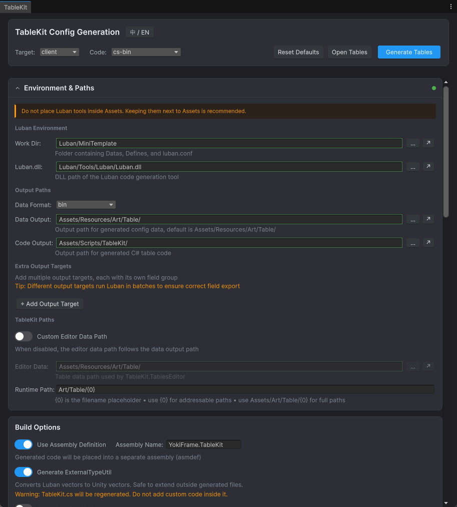

# LubanKit

[中文说明](README.md)

**Unity Luban GUI / visual table editor / code generation workflow tool**

LubanKit is a graphical editor plugin for **Unity + Luban**. It replaces repetitive command-line setup with a Unity Editor workflow for **Luban configuration, config data generation, runtime code generation, data preview, and hot reload**.

> Editor-only tool. The generated runtime code adds **no extra runtime dependency from LubanKit itself**. It is suitable for any Unity project and can be used as a practical solution for **Luban GUI**, **Unity config table tool**, **Luban table editor**, and **Luban code generation workflow**.

---

## Features

- **Visual Configuration** — Configure Luban arguments directly in the Unity Editor
- **One-Click Generation** — Generate config data files and runtime code in one place
- **Smart Runtime Entry Generation** — Generate a ready-to-use `TableKit.cs` entry class
- **Multi-Target Output** — Export client / server / all targets with different data formats
- **Async Loading** — Optional UniTask-based async initialization and preload flow
- **Custom Loaders** — Supports Binary / JSON sync and async loaders, compatible with `Resources`, YooAsset, Addressables, and custom pipelines
- **Data Preview** — Validate Luban config and preview generated JSON data in the editor
- **Editor Mode Access** — Access config tables directly inside editor scripts without entering play mode
- **Assembly Isolation** — Generate an `.asmdef` by default to isolate generated code
- **Hot Reload** — Reload config tables at runtime for hot-update workflows
- **Persistent Settings** — Save all settings to `EditorPrefs`

### Typical Use Cases

- You want a **GUI for Luban** instead of maintaining command-line scripts
- You want to manage the **Luban table generation workflow inside Unity**
- You want **data generation, code generation, and runtime entry generation** in one tool window
- You want to integrate **Luban + Unity** into a cleaner data-driven workflow
- You want flexible loaders for **Resources / YooAsset / Addressables / custom resource systems**

---

## Preview



---

## Installation

### Requirements

| Dependency | Notes |
|------|------|
| [Luban](https://github.com/focus-creative-games/luban) | Config table generation tool (`Luban.dll` required) |
| .NET 8+ SDK | Required to run Luban |
| [Luban.Runtime](https://github.com/focus-creative-games/luban_unity) | Unity runtime package containing `ByteBuf`, `SimpleJSON`, etc. |
| [UniTask](https://github.com/Cysharp/UniTask) (Optional) | Required for async loading mode |

### Option 1: UPM Git URL

1. Open Unity → `Window` → `Package Manager`
2. Click the `+` button → `Add package from git URL...`
3. Enter:

```txt
https://github.com/HinataYoki/LubanKit.git
```

### Option 2: Manual Import

1. Download this repository
2. Put the `Editor/` folder into your Unity project's `Assets/` or `Packages/`
3. Make sure `Luban.Runtime` is installed

### Conditional Compilation

LubanKit uses the `YOKIFRAME_LUBAN_SUPPORT` define. After installing `Luban.Runtime`, add this symbol via `versionDefines` in your asmdef or in `Project Settings > Player > Scripting Define Symbols`.

> If you are already using the YokiFrame ecosystem, this define may be provided automatically.

---

## Quick Start

### 1. Prepare the Luban Environment

Make sure your project contains the Luban tool directory. The default structure expected by LubanKit looks like this:

```txt
Luban/
├── MiniTemplate/                 # Default sample work directory
│   ├── luban.conf                # Luban config file
│   ├── Datas/                    # Excel / JSON config data
│   │   ├── tb_item.xlsx
│   │   └── tb_config.xlsx
│   └── Defines/                  # Table definitions
│       └── __tables__.xlsx
├── Tools/
│   └── Luban/
│       └── Luban.dll             # Luban tool DLL
└── ...                           # Optional extra work dirs or tool files
```

In this layout:

- `Luban/MiniTemplate` is a concrete Luban work directory
- `Luban/Tools/Luban/Luban.dll` is the default Luban DLL location
- If you have multiple work directories, you can switch to any folder that contains `luban.conf`

### 2. Open the Tool Window

Unity menu → `Tools` → `TableKit` → `Config Table Tool` (`Ctrl+L`)

### 3. Configure Paths

For the first run, start with these default paths:

| Item | Description | Example |
|------|------|------|
| Luban Work Directory | Directory that contains `luban.conf` | `Luban/MiniTemplate` |
| Luban.dll Path | Path to `Luban.dll` | `Luban/Tools/Luban/Luban.dll` |
| Data Output Directory | Output path for generated `.bytes` / `.json` files | `Assets/Resources/Art/Table/` |
| Code Output Directory | Output path for generated C# files | `Assets/Scripts/TableKit/` |

> Both relative paths (relative to the Unity project root) and absolute paths are supported.

> `Luban Work Directory` should point to a specific work directory such as `Luban/MiniTemplate`, not just the `Luban/` root folder. `Luban.dll` is typically located at `Luban/Tools/Luban/Luban.dll`.

### 4. Choose Build Parameters

In the command center, choose:

- **Target**: `client` / `server` / `all`
- **Code**: `cs-bin` (recommended) / `cs-simple-json` / `cs-newtonsoft-json`

### 5. Click Generate

LubanKit will automatically:

1. Call Luban to generate config data and Luban code
2. Generate the `TableKit.cs` runtime entry
3. Print execution results in the built-in console

### 6. Use It in Code

```csharp
// Synchronous access (auto-initializes on first access)
var item = TableKit.Tables.TbItem.Get(1001);
Debug.Log(item.Name);
```

---

## Configuration Details

### Luban Environment

| Setting | Description |
|------|------|
| **Luban Work Directory** | A concrete Luban work directory containing `luban.conf`, `Datas/`, and `Defines/` |
| **Luban.dll Path** | Usually located at `Tools/Luban/Luban.dll` under the Luban root |

### Output Paths

| Setting | Description |
|------|------|
| **Data Output Directory** | Output path for generated data files such as `.bytes`, `.json`, `.lua` |
| **Code Output Directory** | Output path for generated C# classes and `TableKit.cs` |
| **Editor Data Path** | Data path used by editor-mode table access; follows the data output path by default |
| **Runtime Path Pattern** | Runtime resource path pattern, such as `{0}`, `Tables/{0}`, or `Art/Table/{0}` |

### Build Options

| Option | Description |
|------|------|
| **Target** (`-t`) | Export scope: `client` / `server` / `all` |
| **Code Target** (`-c`) | Code format: `cs-bin` (recommended) / `cs-simple-json` / `cs-newtonsoft-json` |
| **Data Target** (`-d`) | Data format: `bin` (recommended) / `json` / `lua` |

### Optional Features

| Option | Description |
|------|------|
| **Use Assembly Definition** | Enabled by default. Generates an `.asmdef` for generated config code |
| **Generate ExternalTypeUtil** | Generates Luban ↔ Unity vector conversion helpers; only created when missing |
| **Async Loading Mode** | Generates `InitAsync()` and async preload flow with UniTask |

---

## Runtime Usage

### Synchronous Access

```csharp
// Accessing Tables auto-calls Init() on first use
var tables = TableKit.Tables;

var item = tables.TbItem.Get(1001);
var config = tables.TbGlobalConfig;
```

### Custom Loaders

By default, generated code loads data with `Resources.Load`. To use your own pipeline:

```csharp
// Binary loader for cs-bin
TableKit.SetBinaryLoader(fileName =>
{
    var path = $"Tables/{fileName}";
    return YourLoadMethod(path);
});

// JSON loader for cs-simple-json / cs-newtonsoft-json
TableKit.SetJsonLoader(fileName =>
{
    return YourJsonLoadMethod(fileName);
});

TableKit.Init();
```

### YooAsset Example

```csharp
TableKit.RuntimePathPattern = "Art/Table/{0}";

TableKit.SetBinaryLoader(fileName =>
{
    var path = string.Format(TableKit.RuntimePathPattern, fileName);
    var package = YooAssets.GetPackage("DefaultPackage");
    var handle = package.LoadRawFileSync(path);
    var data = handle.GetRawFileData();
    handle.Release();
    return data;
});

TableKit.Init();
```

### Async Initialization

Enable **Async Loading Mode** in the editor and install UniTask.

```csharp
await TableKit.InitAsync(destroyCancellationToken);

var item = TableKit.Tables.TbItem.Get(1001);
```

### Custom Async Loader

```csharp
TableKit.SetAsyncBinaryLoader(async (fileName, ct) =>
{
    var path = $"Art/Table/{fileName}";
    var package = YooAssets.GetPackage("DefaultPackage");
    var handle = package.LoadRawFileAsync(path);
    await handle.ToUniTask(cancellationToken: ct);
    var data = handle.GetRawFileData();
    handle.Release();
    return data;
});

await TableKit.InitAsync(destroyCancellationToken);
```

### Override Table File Names

Generated table file names are embedded into the runtime code. If needed, you can override them at runtime:

```csharp
TableKit.SetTableFileNames(new[] { "tb_item", "tb_config", "tb_skill" });
await TableKit.InitAsync(destroyCancellationToken);
```

### Editor Mode

```csharp
#if UNITY_EDITOR
var editorTables = TableKit.TablesEditor;
var item = editorTables.TbItem.Get(1001);

TableKit.RefreshEditor();
#endif
```

### Hot Reload

```csharp
TableKit.Reload(() =>
{
    Debug.Log("Config tables reloaded");
});

await TableKit.ReloadAsync(destroyCancellationToken);
```

### Clear

```csharp
TableKit.Clear();
```

---

## Generated Files

After clicking **Generate**, LubanKit writes the following files to the code output directory:

### `TableKit.cs`

This is the runtime entry class. It contains:

- `Tables`
- `Init()` / `InitAsync()`
- `SetBinaryLoader()` / `SetJsonLoader()`
- `SetAsyncBinaryLoader()` / `SetAsyncJsonLoader()`
- `Reload()` / `ReloadAsync()`
- `Clear()`
- `TablesEditor` / `RefreshEditor()`

> Runtime path pattern and editor data path are embedded at generation time.

### `ExternalTypeUtil.cs` (Optional)

Utility helpers for converting Luban types to Unity vector types.

### `{AssemblyName}.asmdef` (Optional)

Assembly definition for isolating generated config code.

### `Luban/` Subdirectory

Contains Luban-generated C# files such as `cfg.Tables` and individual table classes.

---

## Multi-Target Output

You can export multiple targets at the same time, for example client + server, with independent settings for:

- Target
- Data Format
- Data Output
- Code Target
- Code Output

Targets with the same format are merged internally to reduce repeated Luban invocations.

---

## FAQ

### Q: "Luban work directory is missing or invalid"

Make sure the work directory exists and contains `luban.conf`. It should point to a concrete work directory such as `Luban/MiniTemplate`.

### Q: Generated code fails because `ByteBuf` / `SimpleJSON` is missing

Install [Luban.Runtime](https://github.com/focus-creative-games/luban_unity).

### Q: Async mode fails because UniTask is missing

Install [UniTask](https://github.com/Cysharp/UniTask). Async code is wrapped with `#if YOKIFRAME_UNITASK_SUPPORT`.

### Q: Will `ExternalTypeUtil.cs` be overwritten?

No. It is only generated if the file does not already exist.

### Q: How do I use this with different resource systems?

| Resource System | Example Path Pattern | Loading Strategy |
|----------|-------------|---------|
| Resources | `{0}` | Built-in default |
| YooAsset | `Art/Table/{0}` | `SetBinaryLoader` + YooAsset API |
| Addressables | `Tables/{0}` | `SetBinaryLoader` + Addressables API |

### Q: How do I support hot update?

1. Replace the local generated data files
2. Call `TableKit.Reload()` or `await TableKit.ReloadAsync(ct)`

---

## Environment Requirements

- Unity `2021.3+`
- .NET `8+` SDK
- `Luban.Runtime`

---

## Search Keywords

If users are searching for the following, LubanKit is a relevant project:

- `Luban GUI`
- `Unity Luban GUI`
- `Luban table editor`
- `Unity config table tool`
- `Luban visual editor`
- `Luban code generation Unity`

---

## License

MIT License
